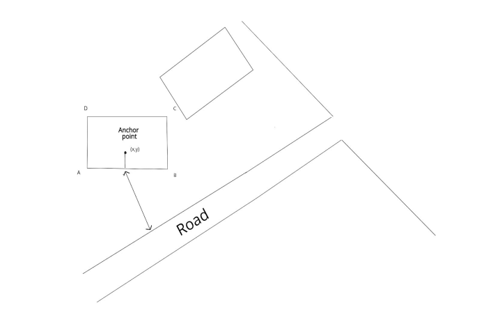
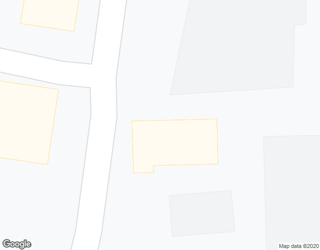

# Location intelligence on Google Maps using computer vision 

## Abstract 

In case of the autonomous decision using the google maps to find the nearest road or building, considering the object in the centre of the image where the global location coordinates known. It needs to find the nearest building or road to get the direction. Assuming google maps does not provide any API for this nearest location detection, it can be done using the image processing technique to solve this Location intelligence problem. if the centre of the location falls within any building, find the nearest wall as entrance, and from the entrance check if there is a road or building which is nearest & mark the location of the target object. It is implemented in this project as a pixel level coordinate and It can be converted into the lat, long information if we know the Ground distance sample of the image and UTM metrics using GDAL. 

#### Python Packages used in this Repository
- numpy 
- math
- cv2
- skimage
- matplotlib
- shapely

## Problem Statement in Image Representation


## Sample Input Image


## Sample Output Image


### console output
```buildoutcfg
tmp_1.png   57.940  building
tmp_2.png   13.000  building
tmp_3.png   47.127  building
tmp_4.png   12.083  building
tmp_5.png   130.000  road
tmp_6.png   14.560  road
tmp_7.png   8.544  building
tmp_8.png   41.000  building
tmp_9.png   19.849  road
```